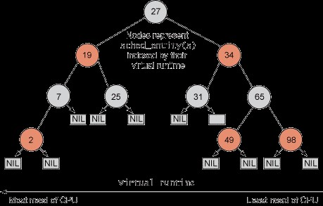
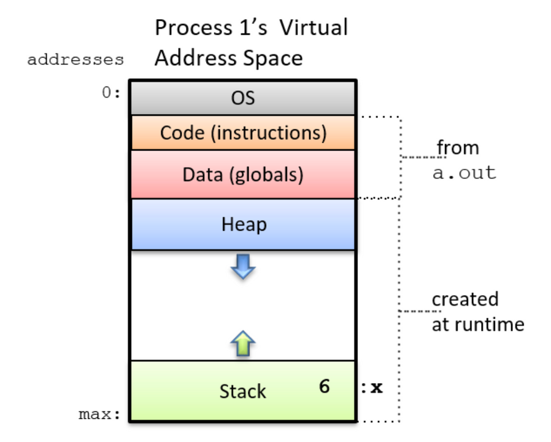
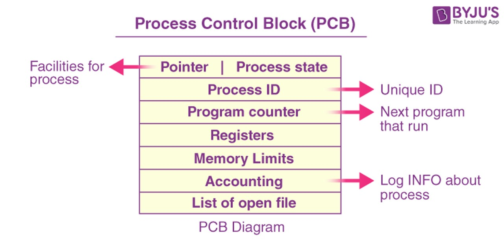
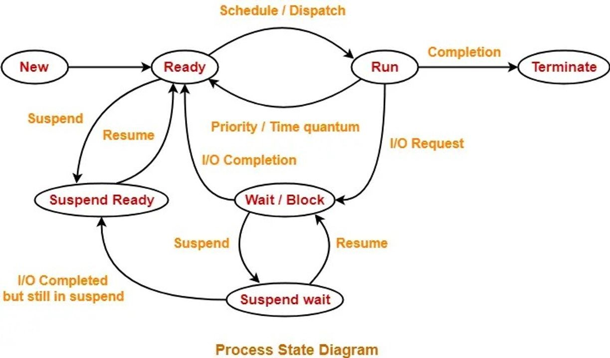
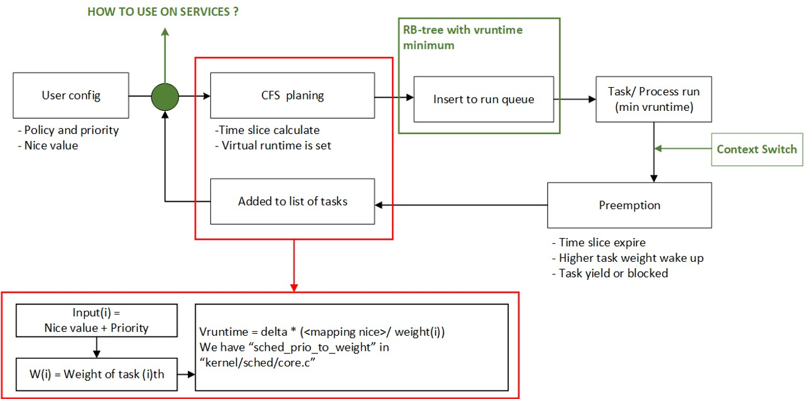
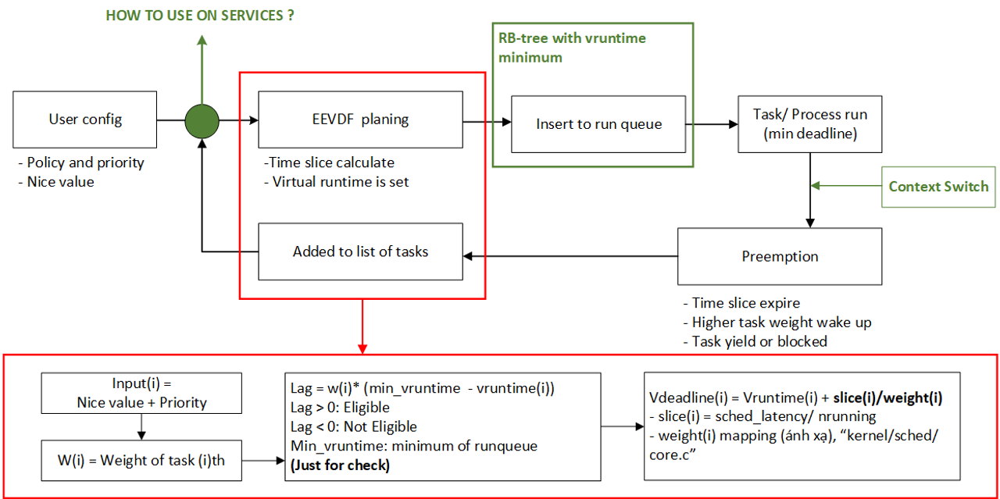
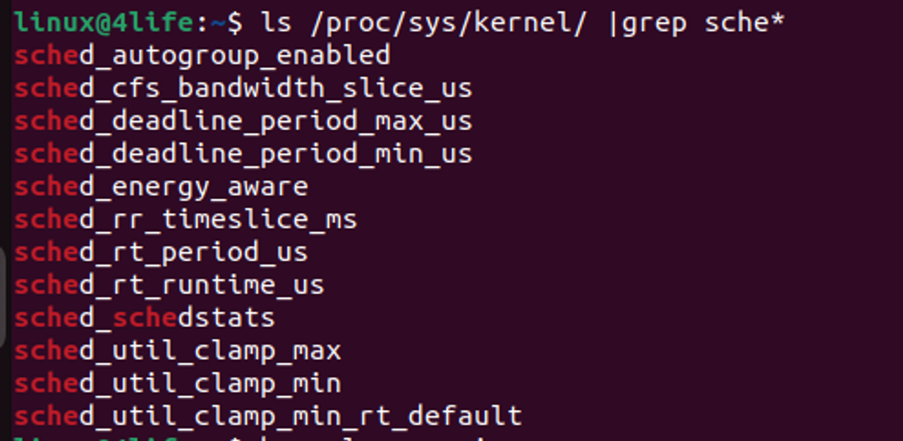

OS Scheduler: CFS (Kernel 5.4) and EEVDF (Kernel 6.12) #1
=========================================================

Bài viết mô tả sự thay đổi trong chương trình / thuật toán lập lịch trên linux kernel, so sánh giữa hai phương pháp CFS và EEVDF dựa trên kernel version 5.4 và kernel version > 6.6

iivdev
21 tháng 3

Đối tượng: Developer and Researcher
Giới thiệu
----------

CFS (cgroup fair scheduler) giới thiệu từ kernel 2.6, cho phé[ hệ thống phân bổ tài nguyên một cách đồng đều resource giữa những process trong một giai đoạn lập trình.

   Cây nhị phân RB của CFS scheduler

EEVDF (earliest eligible virtual deadline) cơ chế mà mục đích hoạt động tương tự như CFS nhưng có vài điểm cái thiện hơn về deadline của các process, thích hợp hơn cho các task có mức độ ưu tiên cao về realtime.
Để hiểu về sư khác nhau giữa hai phiên bản này ta cần có kiến thức nhất định về Memory space (không gian bộ nhớ) và PCB - process control block (một gói thông tin mà chưa đưng các đặc điểm của process) và trạng thái của các process (process state). Đồng thời cả hai Scheduler đểu cần các thống số như: trọng số (task weight), chính sách lập lịch (policy) và nice value (hệ số tử tế của task), do đó cũng cần thiết phải nắm rõ về các thông tin này.
Memory space và PCB (process control block)

   Memory space on device storage

Heap: phân vùng cho cấp phát động bộ nhớ, malloc, calloc, alloc, delete và free.
Stack: các biến local và return address của các function, saved register, padding (ví dụ min size allocate là 8 byte trong 64 bits, thì những data allocate 1 byte thì sẽ có padding chẳng hạn)

   Process control block

Là một khối "đại đoàn kết" có chứa tất tần tật thông tin của một process mà system cần để nắm rõ, trong PCB này cần chú ý các thông tin như Scheduling information, chứa các thông tin về trình lập lịch mà process được cấu hình/ hoạch định.
Trạng thái của một process/task trong khái niệm schedule
--------------------------------------------------------

   Các trạng thái mà process có thể có trong quá trình lập lịch Aelius3108022

Null: tức "tôi không care bạn", tồn tại nhưng chưa được hoạch định chạy. Start: được khởi tạo thông qua các configuration, và được để mắt đến. Ready: trạng thái của process đang nằm trong run queue chờ được chạy.
Scheduler:
----------

Đầu vào của scheduler gồm các thành phần: timeslice, priority, nice value và virtual runtime.
Trong đó, time slices là tài sản mà task hoặc process có thể sở hữu trong một phân đoạn schedule (quá trình lập lịch diễn ra liên tục cho đến khi hệ thống mất nguồn, mỗi phân đoạn được cấu hình khoảng thời gian cụ thể).
.. code-block:: bash

   cat /proc/sys/kernel/sched_rt_period_us

Priority là mức độ ưu tiên mà nó được cài đặt (người dùng cài đặt), trong đó từ 0-99 là các số dành cho kernel process/ tasks theo thứ tự non-incrase, và các số từ 100 - 139(theo mình nhớ) là dành cho user app/ services theo tứ tự non-decrease.
Nice value là giá trị tử tế có ý nghĩa khi các process có chung priority, bằng cách cài đặt các con số từ -20 -> 10 (increase order) các task "nice" hơn sẽ nhường CPU cho các task khác ít nice hơn.
Virtual runtime, thời gian chạy ảo, thực chất là một con số được tính toán từ công thức của scheduler, chỉ là con số, không hơn không kém.
CFS Scheduler
-------------

   CFS overall diagram

User config là phần cài đặt người dùng, trong đó có các service được viết để hỗ trợ boost, ví dụ như "boost-help". Các thông số tồn tại ở trạng thái tĩnh lúc vừa nhập dữ liệu vào. Tiếp đến, vòng hồi tiếp CFS, thuật toán sẽ thực hiện tính toán order cho từng task được cấu hình, từ đó chọn ra một list các task dưới dạng cây nhị phân RB, chọn virtual runtime nhỏ nhất để chạy. Trong quá trình chạy, có thể sẽ tái kích hoạt vòng lặp sớm thông qua các event như timeslice hết hạn/task wakeup với trọng số cao hoặc task chủ động yield (nhường) hoặc block.....
"CFS được thiết kế để phụ vụ cho mục đích multi-task nhưng thiếu đi chơ chế đảm bảo rõ ràng về các yêu cầu về độ trể"
"CFS cho phép tất cả các task chia sẻ tài nguyên công bằng, là nguyên nhân tiềm tàng cho các giao thức/ interface giữa các task có thể chạy"
Giống như bạn có gắng đảm bảo rằng, giám đốc và công nhân đều có cơm ăn áo mặc trong mọi hoàn cảnh, nhưng nếu giám đốc bị đói thì chắc chắn rằng không chỉ một công nhân mà gần như cả nhà máy có nguy cơ sụp đổ theo, do vậy phải có cơ chế đảm bảo rằng người phải hi sinh trước luôn là các công nhân (1 vài) nếu chỉ có 1 chén cơm (tức nếu mức memory ở mức low thì UI interaction phải chạy để đảm bảo user experiment là tốt)
- nguồn tài liệu tham khảo khác: "CFS, bfs, MuQSS, sched_ext, EEVDF"
EEVDF Scheduler
---------------

   EEVDF overall diagram

Thông số trong EEVDF

   Thông số mới có trong linux 6.8

EEVDF thêm cơ chế để kiểm soát đâu là task hợp lệ, giống như một bước xem xét tình hình giữa actual runtime của task đó và virtual runtime của task được cài đặt. Sched chỉ chọn ra những task hợp lệ để chuyển đến bước tiếp theo là phân bổ deadline cho từng task sao cho phù hợp dựa trên số timeslice mà task được cấp và vruntime hiện tại (sau khi được cập nhật). Task có deadline min sẽ được chọn đầu tiên để chạy. Cơ chế tính toán nợ giờ công bằng hơn. Nhưng quan trọng trên hết, nó khắc phục được những hạn chế của CCFS trong việc bị các task khác chơi xỏ.
Có hai thông số sẽ thay đổi chính là sched_deadline_min (overload) và sched_deadline_max (overflow). Nếu để deadline min thì tốn rất nhiều tài nguyên để hoàn thành (gần như là bỏ các task khác luôn), ngược lại, deadline quá lớn (sẽ có nhiều task cũng cần gây preempt cho các task khác).
Ví dụ chứng minh cải thiện về bug của CFS
-----------------------------------------

Trường hợp 1:

Example for delaying settle
Như đã biết, CFS sẽ chạy cho đến hết 100 ms, rồi mới bắt đầu lập lịch lại (không có event nào xảy ra). Điều quan trọng là task B không hề muốn phải chờ tận 50 ms mới tới lượt. Worst case, nó phải chờ (n\\*50ms) task nếu có một queue như vậy, O(n)
Trường hợp 2: Penalty

Example: Sleep gaming is vulnerable
